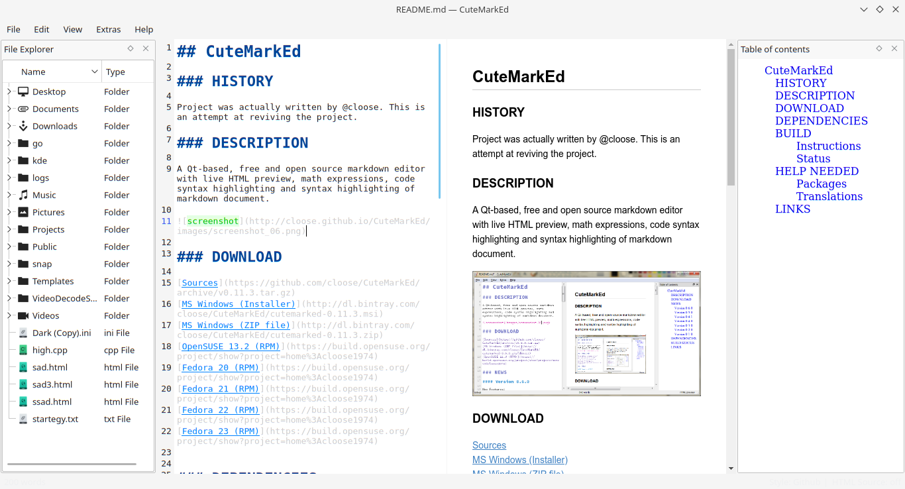

## CuteMarkEd NG

### HISTORY

Project was [originally](https://github.com/cloose/CuteMarkEd/) written by [cloose](https://github.com/cloose). This is an attempt at reviving the project.

### DESCRIPTION

A Qt-based, free and open source markdown editor with live HTML preview, math expressions, code syntax highlighting and syntax highlighting of markdown document.

### DOWNLOAD

[Sources](https://github.com/cloose/CuteMarkEd/archive/v0.11.3.tar.gz)  

### DEPENDENCIES

* [Qt 5.7](http://qt-project.org) (LGPL v2.1)
* [mD4C](http://github.com/mity/md4c) (MIT License)
* [QMarkdownTextedit](https://github.com/pbek/qmarkdowntextedit) (MIT License)

### BUILD

##### Instructions

https://github.com/cloose/CuteMarkEd/wiki/Build-Instructions

##### Status

| Linux | Windows |
| ----- | ------- |
|  |  |

### HELP NEEDED

Help needed for windows and mac build.

##### Packages

We really need help packaging CuteMarkEd. Especially for Linux and Mac OS X. For Linux there is already an [openSUSE Build Service project](https://build.opensuse.org/package/show/home:cloose1974/CuteMarkEd), but it's outdated. Please contact me if you like to help.

##### Translations

We use [Transifex](https://www.transifex.com/projects/p/cutemarked) for the translations. Currently we have translations like Chinese, Czech, German or Greek. But we are always interested in more translations.

### LINKS

[http://www.ohloh.net/p/CuteMarkEd](http://www.ohloh.net/p/CuteMarkEd)  
[http://freecode.com/projects/cutemarked](http://freecode.com/projects/cutemarked)  
[http://qt-apps.org/content/show.php/CuteMarkEd?content=158801](http://qt-apps.org/content/show.php/CuteMarkEd?content=158801)  
[http://www.heise.de/download/cutemarked-1191267.html](http://www.heise.de/download/cutemarked-1191267.html)  
[http://www.softpedia.com/get/Programming/File-Editors/CuteMarkEd.shtml](http://www.softpedia.com/get/Programming/File-Editors/CuteMarkEd.shtml)

